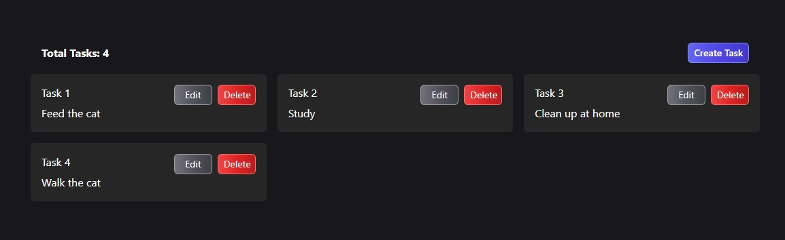
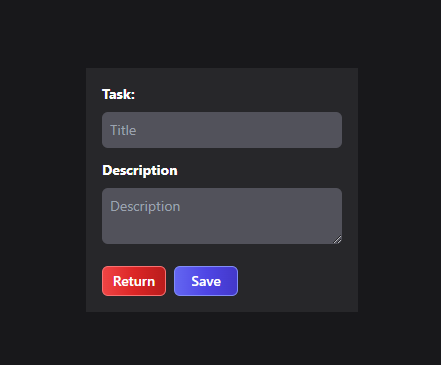

# Aplicación de Tareas con React y Redux

## Descripción

Este es un proyecto simple de gestión de tareas utilizando React y Redux. Permite a los usuarios agregar, eliminar y editar tareas.

## Capturas de pantalla

## Instalación

1. Clonar el repositorio: `git clone https://github.com/peperiqueelmee/Task-Manager.git`
2. Navegar hasta el directorio del proyecto: `cd Task-Manager`
3. Instalar las dependencias: `npm install`

## Cómo usarlo

Después de instalar las dependencias, puedes iniciar el servidor de desarrollo ejecutando `npm run dev`. Luego, puedes abrir tu navegador en `http://127.0.0.1:5173/` para ver y interactuar con la aplicación.

## Live Demo

Puedes ver la aplicación en vivo en [http://www.tu-url-de-produccion.com](https://task-manager-peperiquelmee.netlify.app/).